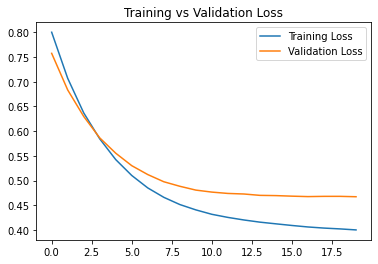
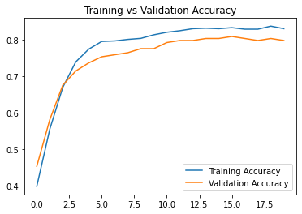
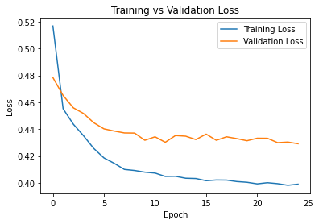
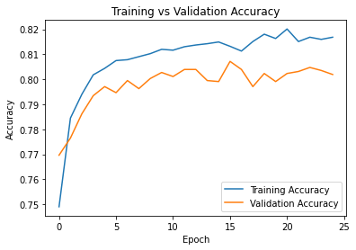
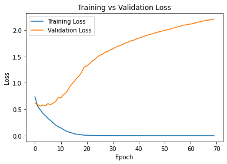
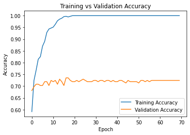
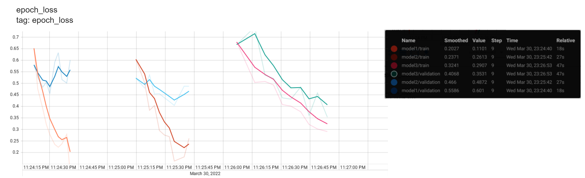
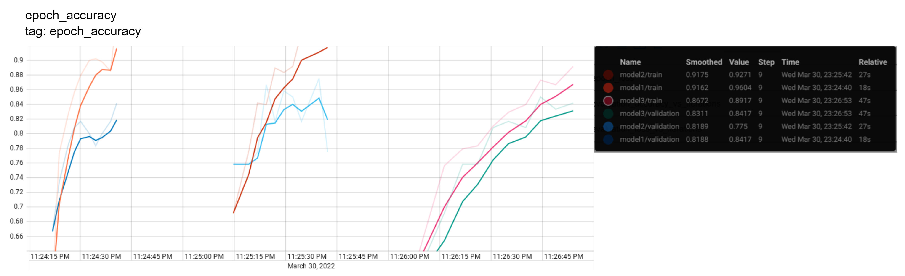

# Deep Learning
<i>Work in progress</i>
- [Feed Forward Neural Network](https://github.com/SarahHannes/dl#feed-forward-neural-network)
  * [Categorial](https://github.com/SarahHannes/dl#categorical)
    + [1.0 Titanic Dataset](https://github.com/SarahHannes/dl#10-titanic-dataset--code)
    + [2.0 Women Chess Dataset](https://github.com/SarahHannes/dl#20-women-chess-dataset--code)
    + [3.0 German Credit Dataset: Overfitted Model](https://github.com/SarahHannes/dl#30-german-credit-dataset-overfitted-model--code)
    + [4.0 German Credit Dataset: Generalized Model](https://github.com/SarahHannes/dl#40-german-credit-dataset-generalized-model--code)
- [Convolutional Neural Network](https://github.com/SarahHannes/dl#convolutional-neural-network)
  * [1.0 CIFAR10](https://github.com/SarahHannes/dl#10-cifar10--code)
  * [2.0 Bread](https://github.com/SarahHannes/dl#20-bread--code)

<!-- toc -->
Feed Forward Neural Network
------------
### Categorical
#### 1.0 Titanic Dataset <a href="feedforward/10_categorical_Titanic.py">[Code]</a>
 

#### 2.0 Women Chess Dataset <a href="feedforward/20_categorical_WomenChess.py">[Code]</a>
 

#### 3.0 German Credit Dataset: Overfitted Model <a href="feedforward/30_categorical_GermanCredit.py">[Code]</a>
> Learning goal: 
> 1. Prepare data and NN model is such a way that it will prone to overfit.
> 	 - One hot encoding all categorical columns to increase the number of feature columns.
> 	 - Increase model complexity (more dense layer, more nodes in each layers).
> 	 - Train with high epochs.
```
Model: "german_credit_model_overfit"
_________________________________________________________________
 Layer (type)                Output Shape              Param #   
=================================================================
 input_1 (InputLayer)        [(None, 61)]              0         
                                                                 
 dense (Dense)               (None, 64)                3968      
                                                                 
 dense_1 (Dense)             (None, 32)                2080      
                                                                 
 dense_2 (Dense)             (None, 16)                528       
                                                                 
 dense_3 (Dense)             (None, 8)                 136       
                                                                 
 dense_4 (Dense)             (None, 2)                 18        
                                                                 
=================================================================
Total params: 6,730
Trainable params: 6,730
Non-trainable params: 0
_________________________________________________________________
```
 
<!-- 
#### 4.0 German Credit Dataset: Generalized Model <a href="feedforward/40_functional_categorical_GermanCredit.py">[Code]</a>
> Learning goal:
> 
> 2.  Reduce overfitting in the previous model.
>     -   Reduce model complexity.
```
```
 
 -->
 Convolutional Neural Network
------------
 #### 1.0 CIFAR10 <a href="cnn/10_cifar10.ipynb"> [Code]</a>
```
Model: "Model4"
_________________________________________________________________
 Layer (type)                Output Shape              Param #   
=================================================================
 conv2d_12 (Conv2D)          (None, 32, 32, 64)        1792      
                                                                 
 conv2d_13 (Conv2D)          (None, 32, 32, 64)        36928     
                                                                 
 max_pooling2d_7 (MaxPooling  (None, 16, 16, 64)       0         
 2D)                                                             
                                                                 
 conv2d_14 (Conv2D)          (None, 16, 16, 32)        18464     
                                                                 
 conv2d_15 (Conv2D)          (None, 16, 16, 32)        9248      
                                                                 
 max_pooling2d_8 (MaxPooling  (None, 8, 8, 32)         0         
 2D)                                                             
                                                                 
 conv2d_16 (Conv2D)          (None, 8, 8, 16)          4624      
                                                                 
 conv2d_17 (Conv2D)          (None, 8, 8, 16)          2320      
                                                                 
 max_pooling2d_9 (MaxPooling  (None, 4, 4, 16)         0         
 2D)                                                             
                                                                 
 flatten_3 (Flatten)         (None, 256)               0         
                                                                 
 dense_9 (Dense)             (None, 32)                8224      
                                                                 
 dropout (Dropout)           (None, 32)                0         
                                                                 
 dense_10 (Dense)            (None, 10)                330       
                                                                 
=================================================================
Total params: 81,930
Trainable params: 81,930
Non-trainable params: 0
_________________________________________________________________
```

 #### 2.0 Bread <a href="http://htmlpreview.github.io/?https://github.com/SarahHannes/dl/blob/main/cnn/20_bread.html"> [Code]</a>
> Learning goal:
> 
> Create, load dataset and build CNN model for "good" and "moldy" bread image classification.
> - 300 images for each class were bulk downloaded using <a href="http://https://chrome.google.com/webstore/detail/image-downloader-imageye/agionbommeaifngbhincahgmoflcikhm?hl=en"> <i>imageye</i> </a>Google Chrome extension.
> - Three baseline models were built with the following architecture:
>   - Model 1: Input + Batch Normalization Layer + 3 Convolutional Layers + 1 Dense Layer
>   - Model 2: Input + Batch Normalization Layer + 4 Convolutional Layers + 1 Dense Layer
>  	- Model 3: Input + Batch Normalization Layer + 5 Convolutional Layers + 1 Dense Layer
> - All models were trained for 10 epochs.
> - Best accuracy score (83%) is obtained by Model 3.
> - Model 3 summary is as below.


```
Model: "sequential_2"
_________________________________________________________________
 Layer (type)                Output Shape              Param #   
=================================================================
 batch_normalization_2 (Batc  (None, 180, 180, 3)      12        
 hNormalization)                                                 
                                                                 
 conv2d_7 (Conv2D)           (None, 178, 178, 128)     3584      
                                                                 
 max_pooling2d_7 (MaxPooling  (None, 89, 89, 128)      0         
 2D)                                                             
                                                                 
 conv2d_8 (Conv2D)           (None, 87, 87, 64)        73792     
                                                                 
 max_pooling2d_8 (MaxPooling  (None, 43, 43, 64)       0         
 2D)                                                             
                                                                 
 conv2d_9 (Conv2D)           (None, 41, 41, 32)        18464     
                                                                 
 max_pooling2d_9 (MaxPooling  (None, 20, 20, 32)       0         
 2D)                                                             
                                                                 
 conv2d_10 (Conv2D)          (None, 18, 18, 16)        4624      
                                                                 
 max_pooling2d_10 (MaxPoolin  (None, 9, 9, 16)         0         
 g2D)                                                            
                                                                 
 conv2d_11 (Conv2D)          (None, 7, 7, 8)           1160      
                                                                 
 max_pooling2d_11 (MaxPoolin  (None, 3, 3, 8)          0         
 g2D)                                                            
                                                                 
 flatten_2 (Flatten)         (None, 72)                0         
                                                                 
 dense_4 (Dense)             (None, 8)                 584       
                                                                 
 dense_5 (Dense)             (None, 2)                 18        
                                                                 
=================================================================
Total params: 102,238
Trainable params: 102,232
Non-trainable params: 6
_________________________________________________________________
```


